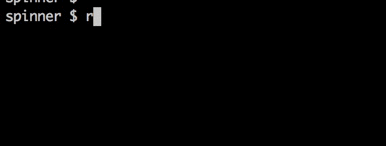

spinner
=======

Inspired by [morishin/spinner](https://github.com/morishin/spinner)

```haskell
import Control.Concurrent (threadDelay)
import System.Spinner

main = withSpin' $ do
    threadDelay 2000000
    putStrLn "◝(*´꒳`*)◜"

```



##LICENSE
BSD3
